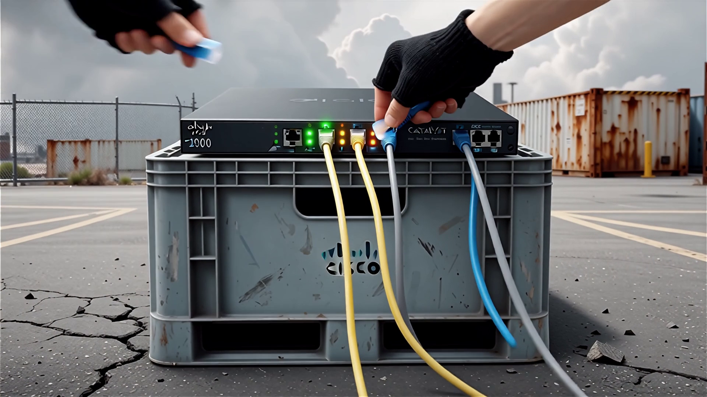
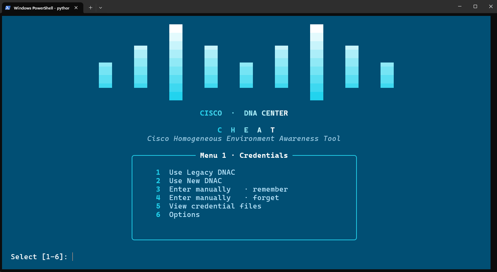
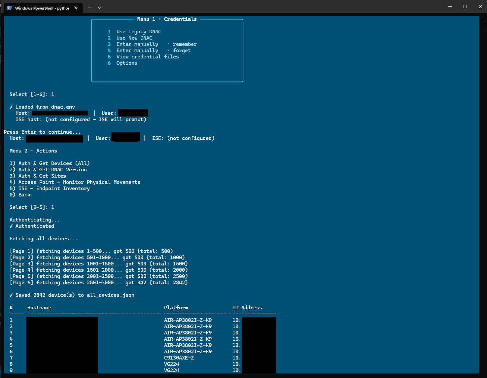
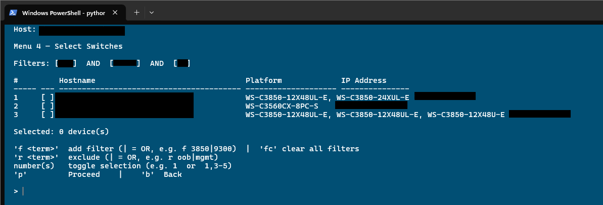
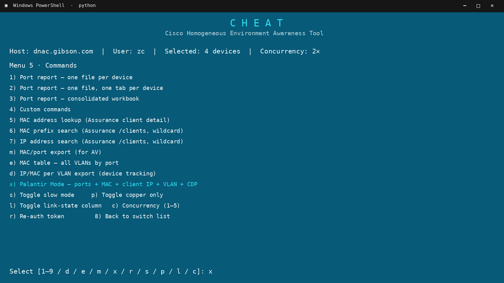

# CHEAT

**Cisco Homogeneous Environment Awareness Tool**

CHEAT collects live switch data through Cisco DNA Center or Catalyst Center and
turns it into Excel reports and draw.io topology diagrams.

<p align="center">
  
</p>

## Features

- Select a switch group once and run multiple reports.
- Combine interface, VLAN, counters, MAC, IP, and CDP data at port level.
- Produce stack-aware Excel workbooks, CSV exports, and draw.io topologies.
- Flag missing, duplicate, or uncertain correlations instead of guessing.
- Run jobs concurrently; batch Catalyst Center Command Runner requests in groups of five.

## Product tour

### Start with a credential profile

Select a saved profile or enter credentials for the current session.



### Collect the device inventory

CHEAT paginates large inventories and shows each device's platform and management IP.



### Filter the switch list

Add inclusion or exclusion filters, then select one switch or a range.



### Select a report

Choose a port report, client search, topology action, or Palantir Mode.



## Main reports

| Report | Menu 5 option | Result |
|---|---:|---|
| Per-device port report | `1` | One Excel file per device. |
| Multi-sheet port report | `2` | One Excel file with a sheet per device. |
| Consolidated port report | `3` | `All Ports`, `Port Utilisation`, and per-device sheets. |
| AV MAC and port report | `m` | Map selected VLAN MAC addresses to likely access ports. |
| Full MAC report | `e` | List MAC entries by port, including child-switch uplinks. |
| IP and MAC report | `d` | List device-tracking bindings for selected VLANs. |
| Palantir Mode | `x` | Combine port, MAC, IP, VLAN, and CDP data. |

Palantir Mode keeps empty physical ports, gives each client address its own row,
and flags missing correlations and VLAN mismatches.

## Other functions

- Search Catalyst Center Assurance by MAC or IP address.
- Monitor access point movement.
- Export Cisco Identity Services Engine (ISE) endpoints.
- Export CDP topology to draw.io.
- Export Catalyst Center site and fabric topology to draw.io.
- Run custom read-only commands.

## Requirements

- Python 3.10 or later
- Network access to Cisco DNA Center or Cisco Catalyst Center
- A Catalyst Center account with API and Command Runner access
- Graphviz for automatic CDP topology layout
- Cisco ISE access for the optional ISE inventory

## Installation

1. Clone the repository.

   ```bash
   git clone https://github.com/nickjennion/cheat.git
   cd cheat
   ```

2. Create a Python virtual environment.

   ```bash
   python3 -m venv .venv
   ```

3. Activate the virtual environment.

   Linux or macOS:

   ```bash
   source .venv/bin/activate
   ```

   Windows PowerShell:

   ```powershell
   .venv\Scripts\Activate.ps1
   ```

4. Install the Python packages.

   ```bash
   python -m pip install -r requirements.txt
   ```

5. Start CHEAT.

   ```bash
   python main.py
   ```

## Credential setup

CHEAT can prompt for credentials or read them from `dnac.env` or `dnac2.env`.

Copy the sample file to create the first profile:

```bash
cp sample_dnac.env dnac.env
```

Use this format:

```dotenv
DNAC_HOST=catalyst-center.example.com
DNAC_USERNAME=your_username
DNAC_PASSWORD=your_password
ISE_HOST=ise.example.com
ISE_VERSION=3.3_patch_1
```

The ISE values are optional.
The Git ignore rules exclude all `.env` files.

> [!WARNING]
> Credential files contain plaintext passwords.
> Restrict file access to the required user.
> Do not commit credential files.

## Basic workflow

1. Start `main.py`.
2. Select a Catalyst Center credential profile.
3. Fetch the device inventory.
4. Filter and select the required switches.
5. Select a report from Menu 5.
6. Review the command list and device list.
7. Confirm the operation.
8. Open the report in `excel_reports/`.

Use Menu 5 option `r` to request a new authentication token.
The refresh request uses a new HTTP session.
The client keeps the previous token if the refresh fails.

## Palantir Mode

Palantir Mode sends these data requests:

- Standard interface inventory commands
- `show cdp neighbors detail`
- `show mac address-table`
- `show device-tracking database`
- `show ip device tracking all`
- `show ip arp`
- `show vlan brief`
- `show interfaces vlan`

Catalyst Center accepts five Command Runner commands per request. CHEAT splits
larger command sets into sequential batches while processing different devices concurrently.

Palantir Mode creates:

- `All Ports`
- `All MAC Addresses`
- `Port Utilisation`
- `VLAN Inventory`
- One sheet for each selected stack

It also creates a tiered CDP topology in `drawio_exports/`.

The output can include these fields:

- Switch and stack member
- Interface and description
- Interface state and protocol
- Port VLAN and client VLAN
- MAC address and MAC type
- Client IP address
- MAC manufacturer (from the bundled OUI Master Database)

Manufacturer lookup uses the compressed `data/oui-master.tsv.gz` snapshot from
[OUI-Master-Database](https://github.com/Ringmast4r/OUI-Master-Database). Set
`CHEAT_OUI_DATABASE` to use another compatible TSV/TSV.GZ file.
- Device-tracking state
- CDP device type and neighbor
- Traffic counters and last input
- Correlation notes

Client IP fields depend on switch device-tracking output; switches with no
recognized rows are reported.

## Session controls

Menu 5 provides these session controls:

| Control | Key | Function |
|---|---:|---|
| Slow mode | `s` | Use longer polling and submission times. |
| Copper-only filter | `p` | Exclude non-copper interfaces from port reports. |
| Link-state data | `l` | Add recent link-change information. |
| Concurrency | `c` | Select one to five concurrent device jobs. |
| Token refresh | `r` | Request a new Catalyst Center token. |

Controls apply to the current session only.

## Generated files

| Path | Content | Git behavior |
|---|---|---|
| `all_devices.json` | Catalyst Center device inventory | Ignored |
| `command_runner_outputs/command_output_*.txt` | Combined raw command output for each device | Ignored |
| `excel_reports/*.xlsx` | Excel reports | Ignored |
| `excel_reports/*.csv` | CSV exports | Not ignored |
| `drawio_exports/*.drawio` | Topology diagrams | Tracked by default |
| `token.env` | Last successful authentication token | Ignored |

> [!CAUTION]
> `token.env` contains a live access token.
> Do not copy this file to a shared system.
> Delete the file when you no longer require the token.

CSV exports can contain network and client data.
The Git ignore rules do not exclude CSV files.
Review each CSV file before you add files to a commit.

## Graphviz setup

The CDP topology export uses the Graphviz `dot` command.
Install Graphviz separately from the Python packages.

Debian or Ubuntu:

```bash
sudo apt install graphviz
```

RHEL or Fedora:

```bash
sudo dnf install graphviz
```

macOS:

```bash
brew install graphviz
```

Windows:

```powershell
winget install Graphviz.Graphviz
```

Add Graphviz's `bin` directory to `PATH` if needed. CHEAT skips the CDP diagram
when `dot` is unavailable; other reports continue.

## Security notes

- Credentials are sent only to the configured Catalyst Center or ISE host.
- The Catalyst Center token uses the `X-Auth-Token` header.
- Raw command output is stored locally.
- Network commands are read-only.
- TLS certificate verification is disabled by default.

> [!WARNING]
> Disabled certificate verification can expose the connection to interception.
> Use CHEAT only on a trusted management network until certificate verification is enabled.

## Test the project

Run the offline automated tests:

```bash
pytest -q --ignore=test_dnac.py --ignore=test_mock_dnac.py --ignore=test_sandbox.py
```

Run the mock end-to-end harness:

```bash
python test_mock_dnac.py
```

Run `test_dnac.py` only against an authorized Catalyst Center system.
The script requests credentials interactively.

Run `test_sandbox.py` only when you want to use the Cisco DevNet sandbox.

## Project structure

| Area | Main files | Purpose |
|---|---|---|
| User interface | `main.py`, `main_cli.py` | Manage credentials, device selection, and report actions. |
| API access | `dnac_client.py`, `ise_client.py` | Access Catalyst Center and ISE. |
| Command execution | `cheat_core.py`, `cheat_constants.py` | Batch, run, poll, and save command jobs. |
| Port parsing | `interface_parser.py`, `port_utilisation.py` | Parse interfaces and calculate port use. |
| Client correlation | `mac_table.py`, `mac_by_port.py`, `device_tracking.py`, `ip_mac_report.py`, `palantir_report.py` | Correlate ports, MAC addresses, IP addresses, and VLANs. |
| Excel export | `excel_generator.py`, `consolidate_report.py` | Create formatted workbooks and CSV files. |
| Topology export | `cdp_detail.py`, `cdp_topology.py`, `topology_dot.py`, `drawio_generator.py` | Build CDP and site topology diagrams. |
| Access point monitoring | `ap_monitor.py` | Detect access point movement. |
| Tests | `test_*.py`, `fixtures/` | Verify parsing, correlation, export, and API behavior. |

## Operational defaults

| Operation | Default |
|---|---:|
| Authentication timeout | 10 seconds |
| Device-list timeout | 30 seconds |
| Command-submission timeout | 10 seconds |
| Commands in each Command Runner request | 5 |
| Task-poll interval | 1 second |
| Task-poll limit | 30 attempts |
| Concurrent device jobs | 2 |
| Maximum concurrent device jobs | 5 |
| HTTP retry count | 3 |

Slow mode changes the submission timeout to 20 seconds.
Slow mode changes the poll interval to 3 seconds.
Slow mode changes the poll limit to 60 attempts.

## Troubleshooting

### Authentication returns HTTP 401

Check the credentials, host, and Catalyst Center API access. Use Menu 5 option
`r` to request a new token.

The refresh request uses the stored username and password, not the expired token.

### A report contains no client IP addresses

Check the latest file in `command_runner_outputs/` for output from `show device-tracking database`
or `show ip device tracking all`. The switch must
return IP, MAC, VLAN, and interface data; formats vary by software release.

### Palantir Mode fails during command submission

Use commit `580574a` or later, which adds five-command batching.

### The topology diagram is missing

Run `dot -V` and install Graphviz if the command is unavailable.

## Change history

See [CHANGELOG.md](CHANGELOG.md) for the project history.
